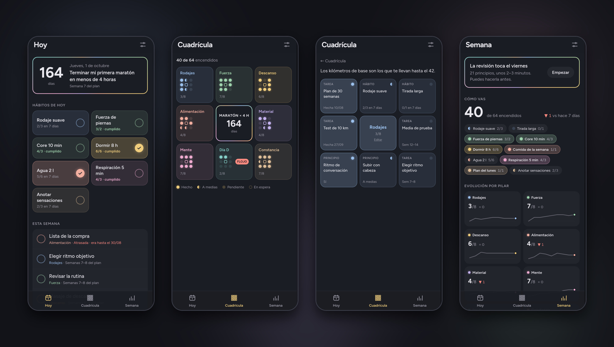

# 🎯 System Harada

> PWA para seguir una cuadrícula Harada: **1 objetivo, 8 pilares y 64 acciones**.
> Responde de un vistazo a tres preguntas: qué toca hoy, qué está hecho y qué
> pilar va flojo.



<sub>Datos de ejemplo: una cuadrícula para terminar una primera maratón en menos de 4 horas.</sub>

El método es de Takashi Harada: una cuadrícula de 9×9 con el objetivo en el
centro, ocho pilares alrededor y ocho acciones concretas por pilar. Es la que
hizo famosa Shohei Ohtani en el instituto. Hacerla en papel es fácil; lo difícil
es seguirla semana a semana sin que se convierta en una lista olvidada. Para eso
está esta app.

Estética "agenda nocturna": fondo oscuro y un color pastel por pilar. Sin
backend, sin cuentas, sin tracking: todos los datos viven en el IndexedDB del
navegador.

## Cómo mide

Cada acción es un punto: **8 por pilar, 64 en total**. Según su tipo, el punto
se enciende de una forma u otra:

| Tipo | Encendido | A medias | Apagado |
|---|---|---|---|
| **Tarea** | Hecha | — | Pendiente |
| **Hábito** | Objetivo cumplido en los últimos 7 días | Algo hecho, sin llegar | Nada en 7 días |
| **Principio** | «Sí» en la revisión semanal | «A medias» | «No», sin revisar o caducado |

- Los hábitos cuentan **los últimos 7 días**, no la semana natural: la
  cuadrícula no se hunde cada lunes.
- Una respuesta de principio **caduca a los 14 días**: si dejas de revisar, la
  cuadrícula no te enseña «sí» de hace un mes.
- Cada cuadrícula tiene una **fase** (unas prácticas, un curso, un plan de
  entrenamiento…). Las acciones que dependen de ella salen **en espera** hasta
  su fecha de inicio, y las tareas pueden tocar en semanas concretas de la fase.

## Qué hace

- **🗓️ Hoy** — cuenta atrás al objetivo y semana de la fase, hábitos de hoy en
  botones grandes con su contador, tareas que tocan esta semana (las atrasadas,
  arriba y en rojo) y un principio del día que prioriza los que fallaste en la
  última revisión. Aviso si un hábito con límite de días seguidos lo va a
  superar.
- **🔲 Cuadrícula** — los 8 pilares, cada uno como su propio mini 3×3 de puntos:
  la pantalla entera es la cuadrícula de 81 casillas del método. El pilar más
  flojo lleva su etiqueta. Al tocar un pilar se abre su 3×3; al tocar una acción,
  su ficha, desde la que se marca, se edita o se corrige un día olvidado.
- **📊 Semana** — revisión de principios con tarjetas (*Sí / A medias / No*),
  resumen de cómo vas frente a hace 7 días, evolución por pilar con gráficos SVG
  sin dependencias y lista de logros con fecha, lista para copiar.
- **⚙️ Ajustes** — objetivo, fase y fechas, día de la revisión, copia de
  seguridad y empezar de nuevo.

Todo se autoguarda en cada toque.

## Tus datos

- **Exportar** genera dos archivos: la copia completa en JSON, que sirve para
  recuperar todo o pasarlo a otro dispositivo, y una **foto de la semana en
  Markdown**, con los puntos por pilar como propiedades para Dataview en Obsidian.
- En el móvil, el botón abre el menú de compartir del sistema; si el navegador no
  lo permite, descarga los archivos.
- **Importar** valida la copia antes de tocar nada y pide confirmación.
- Aviso en Hoy si llevas 7 días sin copia, y petición al navegador de
  **almacenamiento persistente** para que no borre los datos si falta espacio.

## Empezar tu cuadrícula

La app arranca con una cuadrícula vacía:

1. **Ajustes** → escribe tu objetivo, su nombre corto y su fecha. Pon nombre a tu
   fase y, cuando la sepas, su fecha de inicio.
2. **Cuadrícula** → toca un pilar y luego su centro para ponerle nombre y su
   porqué.
3. Toca cada acción → **Editar**: texto, tipo (tarea, hábito o principio), cuándo
   toca, veces por semana y si espera al inicio de la fase.

Si tu fase tiene un horario fijo (horas totales, horas por día, festivos y un
parón), puedes añadirlo como `calendario` en el JSON de la copia e importarlo:
Ajustes calculará cuándo termina.

## Cómo está hecha

- **Astro 5 + Tailwind 4 + TypeScript** → PWA instalable y offline
  (`@vite-pwa/astro`).
- **IndexedDB** (`idb-keyval`) como única persistencia, con las claves de cada
  cuadrícula en su propio espacio.
- **Lógica pura y separada de la interfaz**: motor de puntos, ventanas de 7 días,
  semanas ISO, tareas del día, caducidad, exportación y cálculo del fin de fase.
- **80 tests** (Vitest) sobre esa lógica, con una cuadrícula de prueba neutra.
- **Fuente self-hosted** (Figtree vía `@fontsource`) para que el offline no
  dependa de la red.

## Correrla en local

```sh
npm install
npm run dev      # desarrollo
npm test         # tests
npm run check    # tipos
npm run build    # producción (dist/)
```

## Notas

- **Modo simulación** para probar cómo se vería la app otro día: abre
  `/?simular=AAAA-MM-DD`. Una franja arriba avisa de que está activo; se quita
  con `?simular=no` o con el enlace «Salir».
- El método se apoya en la revisión semanal: sin ella, los principios caducan y
  la cuadrícula lo refleja.


